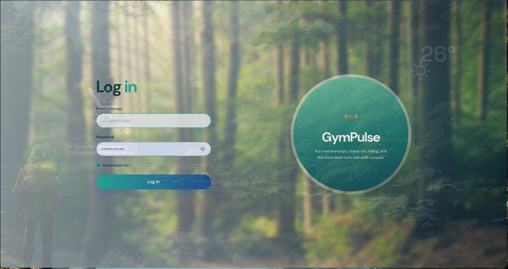
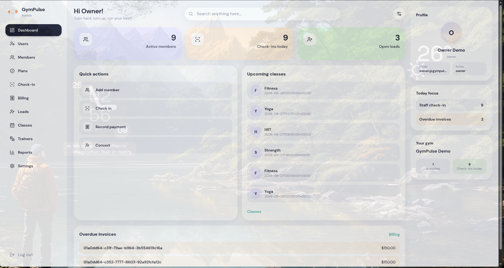

<p align="center">
  
</p>

<h1 align="center">GymPulse</h1>

<p align="center">
  <strong>Self-hostable gym management</strong> for owners who want their own stack —
  members, check-in, billing, classes, trainers, and reports — without a SaaS lock-in.
</p>

<p align="center">
  <a href="LICENSE"></a>
  
  
  
  
  
</p>

<p align="center">
  <a href="#-screenshots">Screenshots</a> ·
  <a href="#-what-you-get">Features</a> ·
  <a href="#-quick-start">Quick start</a> ·
  <a href="#-apps">Apps</a> ·
  <a href="CONTRIBUTING.md">Contributing</a> ·
  <a href="LICENSE">License</a>
</p>

---

## Why GymPulse

| | |
|:---|:---|
| **You own the data** | One gym per deployment. Postgres on your host — no BaaS, no transaction-mode pooler. |
| **One API, three frontends** | Go server is the only DB client. Admin, member PWA, and landing talk REST only. |
| **Front-desk ready** | Staff check-in (QR + search), screenshot payment review, members & memberships. |
| **Spec-driven** | Product changes go through OpenSpec → OpenAPI → code. |

---

## Screenshots

### Admin — staff dashboard

<p align="center">
  
  &nbsp;
  
</p>

<p align="center"><em>Sign-in and day-to-day ops for owner, manager, and receptionist.</em></p>

### App — member & trainer PWA

<p align="center">
  
  &nbsp;
  
  &nbsp;
  
  &nbsp;
  
</p>

<p align="center"><em>Auth, home, check-in QR, and profile on mobile.</em></p>

### Landing — public marketing site

<p align="center">
  
  &nbsp;
  
</p>

<p align="center"><em>SEO-friendly Vue site for your gym’s public face.</em></p>

---

## What you get

| Area | Highlights |
|:---|:---|
| **Members** | Profiles, memberships, plans, notes, leads |
| **Check-in** | QR token, staff search, today’s list, present now |
| **Billing** | Invoices, cash / Telebirr / CBE screenshot review |
| **Classes & PT** | Sessions, bookings, trainers |
| **Reports** | Attendance and ops views for staff |
| **Deploy** | Plain Go binary + host Postgres + Caddy/nginx |

---

## Quick start

**Requirements:** Go 1.26+, PostgreSQL 16+, Node.js 20+, `make`. No Docker.

```bash
cp .env.example .env
# Set DATABASE_URL, TEST_DATABASE_URL, AUTH_JWT_SECRET
# Use a direct or session-mode Postgres URL (not transaction-mode / Supabase).

make generate
make db-create
make migrate-up
make seed          # demo users — see users.md
make dev           # API on :8080
```

Demo accounts (password **`GymPulse1!`**) are in [`users.md`](users.md).

| Check | Meaning |
|:---|:---|
| `GET /health` | Liveness (no DB) |
| `GET /ready` | Postgres ping |

<details>
<summary><strong>PostgreSQL setup (Fedora / Ubuntu / macOS)</strong></summary>

### Fedora

```bash
sudo dnf install postgresql-server postgresql
sudo postgresql-setup --initdb
sudo systemctl enable --now postgresql
```

Edit `pg_hba.conf` so local TCP uses `scram-sha-256`, then `sudo systemctl reload postgresql`.

### Ubuntu / Debian

```bash
sudo apt update && sudo apt install postgresql postgresql-client
sudo systemctl enable --now postgresql
```

Update `/etc/postgresql/16/main/pg_hba.conf` for `scram-sha-256`, then reload.

### macOS

```bash
brew install postgresql@16
brew services start postgresql@16
```

### Role & database

```bash
sudo -u postgres psql -c "CREATE ROLE gympulse LOGIN PASSWORD 'gympulse' CREATEDB;"
sudo -u postgres psql -c "CREATE DATABASE gympulse OWNER gympulse;"
```

`make db-create` is idempotent if the role already exists.

</details>

<details>
<summary><strong>Full bootstrap (lint + test + build)</strong></summary>

```bash
cp .env.example .env
make generate && make db-create && make migrate-up && make seed
make build && make lint && make test
```

Tests need `TEST_DATABASE_URL` pointing at a DB that allows `CREATEDB` (usually the `postgres` maintenance DB). They create `gympulse_test_*` databases and drop them on cleanup — no SQL mocks, no containers.

</details>

<details>
<summary><strong>Make targets</strong></summary>

| Target | Purpose |
|:---|:---|
| `make generate` | OpenAPI → Go + TypeScript client |
| `make db-create` | Create app database |
| `make migrate-up` / `down` / `status` | Migrations |
| `make seed` | Demo data |
| `make dev` | Run API |
| `make admin-dev` / `admin-build` | Admin Vite |
| `make run` | Built `server/bin/gympulse` |
| `make test` / `lint` / `build` | Quality |

</details>

---

## Apps

| App | Stack | Docs |
|:---|:---|:---|
| **API** | Go + Chi + Postgres | this README · `server/` |
| **Admin** | React + Vite | [admin/README.md](admin/README.md) |
| **PWA** | React + Vite | [app/README.md](app/README.md) |
| **Landing** | Vue 3 + Vite | [landing/README.md](landing/README.md) |

```bash
# Terminal 1 — API
make generate && make migrate-up && make seed && make dev

# Terminal 2 — Admin
cd packages/api-client && pnpm install && pnpm run generate
cd ../../admin && pnpm install && pnpm run dev   # or: make admin-dev

# Terminal 3 — Member PWA
cd app && pnpm install && pnpm run dev

# Landing
cd landing && pnpm install && pnpm run dev
```

Frontends use `@gympulse/api-client` only. The Go process never shares the database with the browser.

---

## Architecture

```
┌─────────────┐   ┌─────────────┐   ┌─────────────┐
│   admin/    │   │    app/     │   │  landing/   │
│  React PWA  │   │  React PWA  │   │   Vue SEO   │
└──────┬──────┘   └──────┬──────┘   └──────┬──────┘
       │                 │                 │
       └────────────┬────┴─────────────────┘
                    │  REST /v1  (openapi.yaml)
                    ▼
            ┌───────────────┐
            │  server/ Go   │  ← only DB client + authz
            └───────┬───────┘
                    ▼
            ┌───────────────┐
            │ PostgreSQL 16 │
            └───────────────┘
```

- Single `DATABASE_URL`, default schema, UUIDv7 in Go  
- Product specs live in `openspec/` — see [AGENTS.md](AGENTS.md) and [CONTRIBUTING.md](CONTRIBUTING.md)

---

## Production

1. `make build` → `server/bin/gympulse`
2. Set `DATABASE_URL` (direct or session-mode only)
3. `gympulse db create` if needed, then `gympulse migrate up`  
   (`AUTO_MIGRATE` defaults to false; production rollback = restore from `pg_dump`, not `migrate down`)
4. Run under systemd — example: [`docs/systemd/gympulse.service`](docs/systemd/gympulse.service)
5. TLS + static apps with Caddy or nginx — [`docs/reverse-proxy.md`](docs/reverse-proxy.md)
6. Backups — [`docs/backup.md`](docs/backup.md)

---

## Contributing

We welcome issues and PRs. Please read **[CONTRIBUTING.md](CONTRIBUTING.md)** (OpenSpec for behavior changes, architecture rules, PR checklist).

---

<p align="center">
  <sub>Licensed under the <a href="LICENSE">BSD 2-Clause License</a> · Copyright © 2026 Miftah Fentaw</sub>
</p>
