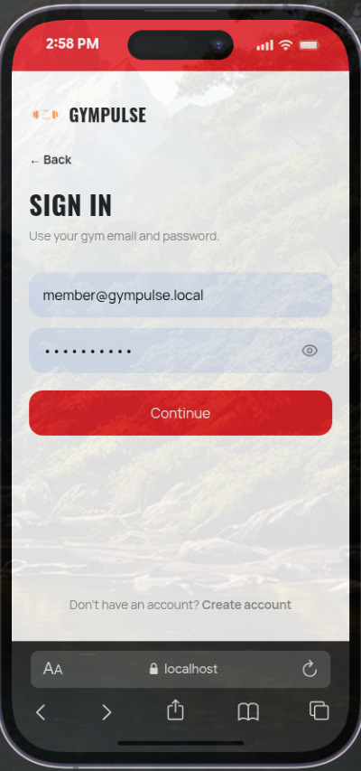
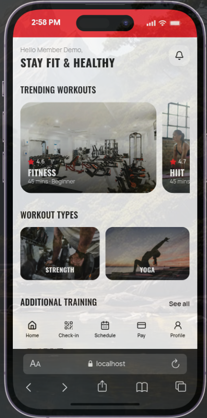
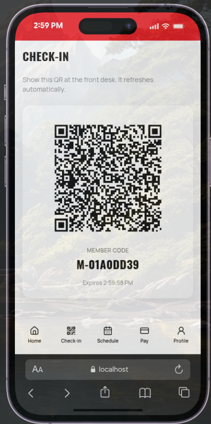
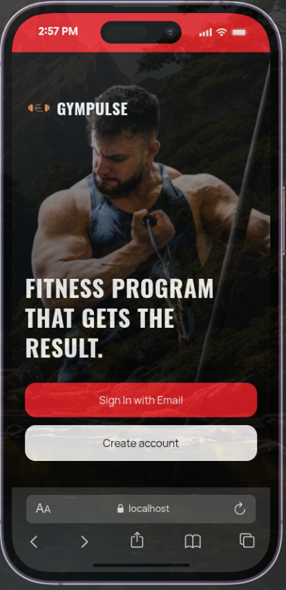

# Member & trainer PWA

React + Vite progressive web app for members and trainers. Uses `@gympulse/api-client` against the Go API.

## Screenshots

<p>
  
  
  
  
</p>

## Run locally

```bash
# API must be running (from repo root: make generate && make migrate-up && make seed && make dev)

cd packages/api-client && pnpm install && pnpm run generate
cd ../../app && pnpm install && pnpm run dev
```

Open the Vite URL (typically http://localhost:5174). Proxy `/v1` to the Go API the same way as admin if configured.

Demo member/trainer accounts: [`users.md`](../users.md) (password `GymPulse1!`).
