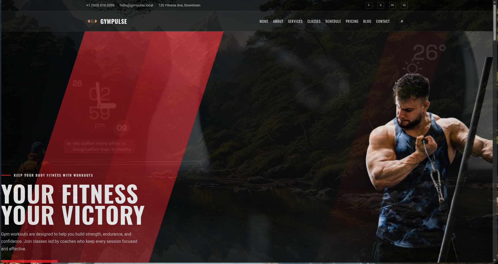
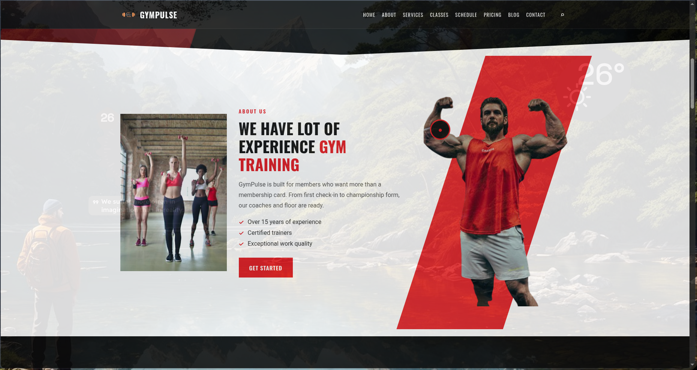

# Landing

Public marketing site for GymPulse.

## Screenshots

<p>
  
  
</p>

```bash
cd landing
pnpm install
cp .env.example .env   # set VITE_SITE_URL to your public origin
pnpm run dev           # http://localhost:4321
pnpm run build
```

## SEO

Set `VITE_SITE_URL` (no trailing slash), e.g. `https://www.yourgym.com`. Build injects it into:

- Canonical, Open Graph, Twitter Card, and JSON-LD in `index.html`
- `dist/robots.txt` and `dist/sitemap.xml`

Assets used for sharing: `public/og-image.jpg` (1200+ wide), `public/logo.png`.

## Page assets

- Brand: `public/logo.png`
- Hero athlete: `public/image1.png`
- About athlete: `public/image2.png`
- Hero video: `public/hero.mp4`
- Other sections: `public/media/*`
